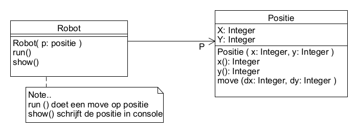

# Opdracht
Gegeven is het klassendiagram:



De klasse Positie is een concrete klasse. Zoals blijkt uit het diagram is Robot afhankelijk van die concrete klasse.
1. Maak een implementatie van dit klassendiagram.
2. Verander het klassendiagram zo dat voldaan wordt aan het Inversion Dependency Principle.
3. Implementeer het aangepaste klassenmodel. De volgende main functie moet kunnen runnen:

```cpp
int main()
{
   Positie P(5,10);
   Robot R(&P);
   R.run();
   R.show();

   return 0;
}
```
Leg uit waarom (en wanneer) de implementatie van opgave 3 beter is dan die van 1.
