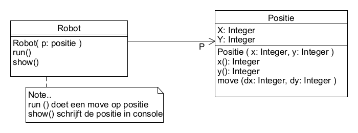

# Opdracht
Gegeven is het klassendiagram:



De klasse Positie is een concrete klasse. Zoals blijkt uit het diagram is Robot afhankelijk van die concrete klasse.
1. Maak een implementatie van dit klassendiagram.
2. Verander het klassendiagram zo dat voldaan wordt aan het Dependency Inversion Principle.
3. Implementeer het aangepaste klassenmodel. De volgende main functie moet kunnen runnen:

```cpp
int main()
{
   Positie P(5,10);
   Robot R(&P);
   R.run();
   R.show();

   return 0;
}
```
Leg uit waarom (en wanneer) de implementatie van opgave 3 beter is dan die van 1.

## Antwoord op opgave 1

De eerste versie kan rechtstreeks met de concrete klasse `Positie` worden uitgewerkt. `Robot` bewaart dan een pointer naar een `Positie`-object en roept daarop `move()` en de leesfuncties `x()` en `y()` aan.

Dat betekent dat `Robot` hard gekoppeld is aan de concrete klasse `Positie`. De klasse `Robot` kan dus alleen werken met deze ene implementatie.

## Antwoord op opgave 2

Om te voldoen aan het Dependency Inversion Principle moet `Robot` niet meer afhangen van de concrete klasse `Positie`, maar van een abstractie.

Wat er in UML moet komen:

- Voeg een nieuwe abstracte klasse of interface toe, bijvoorbeeld `IPositie`.
- Zet daarin de operaties die `Robot` nodig heeft:
   - `x() : Integer`
   - `y() : Integer`
   - `move(dx : Integer, dy : Integer)`
- Laat `Positie` erven van `IPositie`.
- Laat `Robot` niet meer linken naar `Positie`, maar naar `IPositie`.
- De constructor van `Robot` krijgt dan een parameter van het type `IPositie*` of `IPositie&` in plaats van `Positie*`.

In UML teken je dus:

- een generalisatiepijl van `Positie` naar `IPositie`
- een associatie of afhankelijkheid van `Robot` naar `IPositie`
- `IPositie` als abstracte klasse, dus met een schuine stijl of het stereotype `{abstract}`

## Antwoord op opgave 3

Met het aangepaste model kan de gevraagde `main` gewoon werken:

```cpp
int main()
{
    Positie P(5,10);
    Robot R(&P);
    R.run();
    R.show();

    return 0;
}
```

Hierbij gebruikt `Robot` alleen de abstracte interface van de positie. De concrete klasse `Positie` levert de echte implementatie.

## Waarom opgave 3 beter is dan opgave 1

Opgave 3 is beter omdat `Robot` dan los gekoppeld is van de concrete klasse `Positie`. Daardoor:

- is de code flexibeler
- kan `Robot` ook met andere positie-implementaties werken
- is de code eenvoudiger te testen
- worden wijzigingen in de concrete klasse minder snel een probleem voor `Robot`

De implementatie van opgave 3 is vooral beter wanneer je later meerdere soorten posities wilt gebruiken, of wanneer je de code wilt uitbreiden zonder `Robot` telkens te moeten aanpassen.

Kort samengevat: opgave 1 werkt direct, maar opgave 3 is onderhoudsvriendelijker, uitbreidbaarder en beter volgens het Dependency Inversion Principle.
