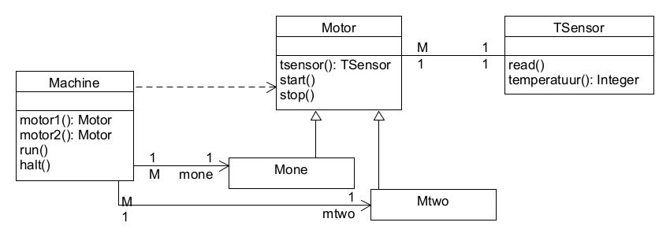
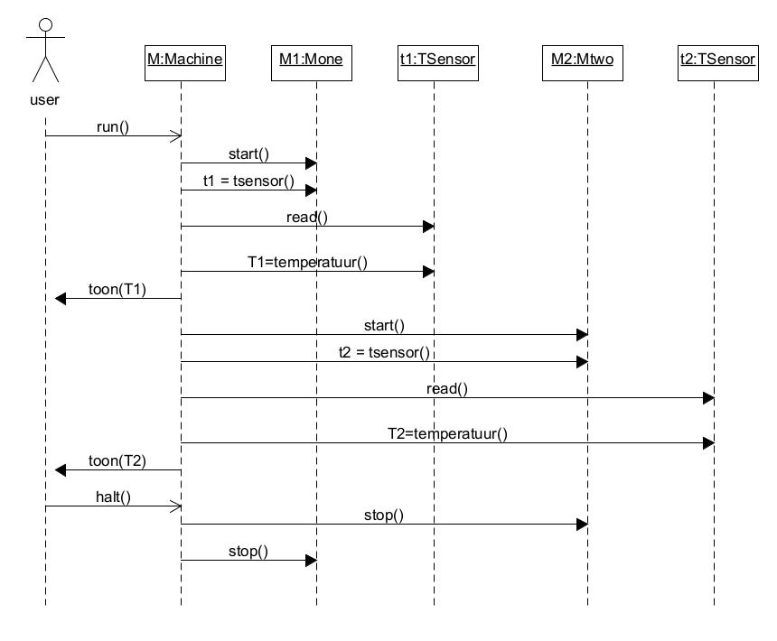

# Opdracht: Machines en Motoren
Het doel van deze opdracht is het ontwerpen en realiseren van een softwaresysteem aan de hand van een gegeven klassenmodel en een gegeven sequentiediagram uit de analysefase en aan de hand van gegeven niet functionele systeemeisen.

## Beschrijving van de probleemruimte.

Een productiestraat bevat 1 machine die precies 2 motoren bevat: Mone en Mtwo. De temperatuur van de motoren is belangrijk omdat overbelasting niet onmogelijk is en iedere motor moet daarom worden gecontroleerd d.m.v. een temperatuursensor.

In de toekomst kunnen andere modellen van machines worden verwacht die in de productiestraat moeten kunnen worden ingepast. Alle modellen machines, dus ook eventuele toekomstige modellen, bevatten precies 2 motoren voor de verwerking van de producten: 1 Mone en 1 Mtwo. Er zijn verschillende soorten motoren Mone en Mtwo mogelijk die ook vervangen moeten kunnen worden door andere modellen.

Gegeven is verder het volgende (niet volledige) klassemodel dat ontstaan is in de analysefase van de ontwikkeling:

Ook is het volgende sequentiediagram bepaald in de analysefase van de ontwikkeling:

## Beschrijving van de systeemeisen.

Uit het use case diagram volgen onder meer de volgende functionele eisen:
- de machine moet kunnen worden aangeschakeld,
- de machine moet kunnen worden uitgeschakeld,
- de temperaturen van de motoren moeten worden weergegeven.

Er moet ook een user interface (UI) worden ontworpen voor het aansturen van de machines. Deze UI moet voorlopig zo eenvoudig mogelijk worden uitgevoerd, bijvoorbeeld als een Console Application. Later moet het mogelijk zijn een andere interface te ontwerpen en te implementeren. Er wordt gebruik gemaakt van een Observer* voor het in de interfacelaag weergeven van de temperatuur van de robot.

(* Het Observer pattern is wellicht nog niet behandeld in het college. Je weet echter genoeg van patterns om zelf te googelen, of het copilot te vragen je te helpen)

Het systeem moet modulair worden opgebouwd waarbij het mogelijk moet zijn de verschillende onderdelen te hergebruiken. Andere belangrijke niet functionele systeemeisen zijn onderhoudbaarheid en flexibiliteit. Het systeem moet eenvoudig kunnen worden aangepast aan nieuwe modellen van machines, aan nieuwe modellen van motoren, sensoren en aan een andere interface.

# Opdrachten

a. Geef een volledig klassenmodel van het ontwerp met daarin alle details. Dus ook, in de vorm van notes, de algoritmen vermelden bij alle operaties en constructors. Geef ook van iedere klasse duidelijk aan in welke package deze zich bevindt. Let op: het is belangrijk dat alle relaties en associaties in het model worden getekend omdat bij de berekening van de parameters in vraag b hiervan gebruik gemaakt moet worden.  
b. Geef aan waar in je ontwerp je wijzigingen verwacht (op basis van de specs). Let uit hoe je in je ontwerp daar rekening mee gehouden hebt.  
c. Bereken de instabiliteit  van elke package.  
d.Realiseer het ontwerp in C++.  
